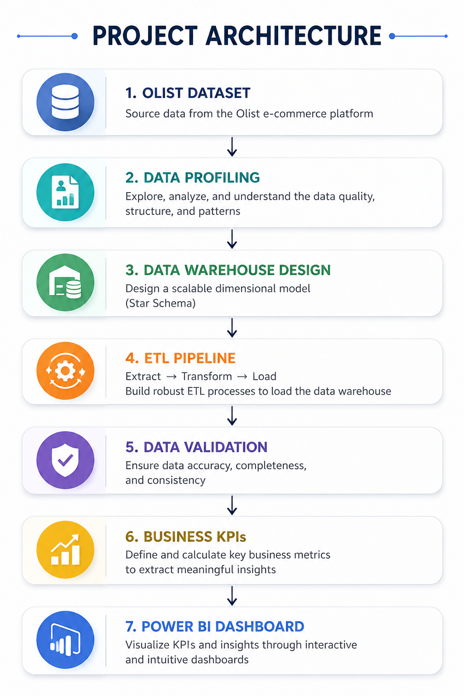

# Olist Marketplace Sales & Logistics Analytics

**SQL Server · SQL · Power BI · ETL · Data Warehousing · Star Schema**

## Project Overview

**Olist** is a Brazilian e-commerce marketplace that connects customers with sellers across multiple product categories and regions.

The dataset contains transactional information about **orders, customers, products, sellers, payments, reviews, and delivery operations**.

### Business Problem

Olist's operational data is distributed across multiple datasets, making it difficult to quickly answer important business questions:

- How much revenue is the marketplace generating?
- How are sales changing over time?
- Which product categories generate the most revenue?
- Which regions generate the most sales?
- Which sellers contribute the most revenue?
- How efficiently are orders being delivered?
- How many orders arrive late?

### Solution

I built an **end-to-end SQL Server and Power BI analytics solution** that transforms raw Olist data into a structured **Star Schema**, validates the resulting warehouse, calculates business KPIs, and presents the results through an interactive Power BI dashboard.

The complete analytical workflow is:

**Raw Data → Data Profiling → Data Modeling → ETL → Validation → SQL Analytics → Power BI → Business Insights**

---

# Key Business Findings

The analysis revealed several important patterns in Olist's marketplace performance:

- The analytical warehouse contains **more than 110,000 delivered order-item records** available for sales analysis.
- Revenue shows clear variation over time, allowing stronger and weaker sales periods to be identified.
- Revenue is concentrated among several leading **product categories**, while other categories contribute considerably less.
- Geographic analysis reveals meaningful differences in revenue contribution across **Brazilian customer states**.
- Seller performance is uneven, with a relatively small group of sellers contributing a significant portion of marketplace revenue.
- Delivery performance represents an important operational KPI, with thousands of orders arriving after their estimated delivery date.
- Average delivery time and late-order analysis provide a direct way to evaluate marketplace logistics performance.

---

# Business Recommendations

Based on the analysis, Olist should:

- **Prioritize high-revenue product categories** while investigating opportunities to grow categories with strong order volume but lower revenue contribution.
- **Focus commercial efforts on high-value geographic markets** and investigate weaker states for potential growth opportunities.
- **Identify and support top-performing sellers**, while benchmarking lower-performing sellers against marketplace leaders.
- **Monitor late deliveries as a core operational KPI** and investigate sellers, locations, or periods associated with weaker delivery performance.
- **Align marketplace planning with sales trends** to better anticipate periods of stronger and weaker demand.
- Evaluate marketplace performance using **revenue, order volume, and logistics metrics together** rather than focusing on sales alone.

---

# Power BI Dashboard

The final Power BI dashboard provides an interactive view of **sales, product, geographic, seller, and logistics performance** across the Olist marketplace.


### Executive KPIs

The dashboard tracks:

- **Total Revenue**
- **Total Orders**
- **Average Order Value**
- **Average Delivery Time**
- **Late Orders**
- **Late Delivery Rate**

### Sales & Product Performance

The dashboard allows users to analyze:

- Revenue trends over time
- Revenue by product category
- Orders by product category
- Highest-performing product categories
- Changes in marketplace performance over time

### Geographic & Seller Performance

The dashboard identifies:

- Revenue by customer state
- Geographic concentration of marketplace sales
- Highest-revenue sellers
- Differences in seller contribution to marketplace revenue

### Logistics Performance

Operational performance is evaluated through:

- Average delivery time
- Number of late orders
- Late-delivery rate
- Delivery performance across marketplace transactions

### Interactive Filters

Users can dynamically explore the data using:

- **Year**
- **Product Category**
- **Customer State**
- **Seller State**

### Power BI File

The complete interactive Power BI report is available in the repository:

[`dashboard/Dashboards.pbix`](dashboard/Dashboards.pbix)

---

# Business Questions Answered

The project was designed around practical business questions rather than simply visualizing the available data.

### Sales

- What is the total marketplace revenue?
- How has revenue changed over time?
- What is the average order value?
- Which periods generate the strongest sales?

### Products

- Which product categories generate the most revenue?
- Which categories receive the most orders?
- How concentrated is marketplace revenue across categories?

### Geography

- Which Brazilian states generate the most revenue?
- How does marketplace performance differ geographically?

### Sellers

- Which sellers generate the most revenue?
- How concentrated is revenue among marketplace sellers?

### Logistics

- What is the average delivery time?
- How many orders arrive late?
- What percentage of orders are delivered after the estimated delivery date?

---

# Architecture

```text
Olist CSV Datasets
        ↓
   Data Profiling
        ↓
SQL Server Source Data
        ↓
Data Cleaning & Transformation
        ↓
     ETL Pipeline
        ↓
SQL Server Data Warehouse
        ↓
      Star Schema
        ↓
   Data Validation
        ↓
    SQL Analytics
        ↓
      Power BI
        ↓
   Business Insights
```



---

# Data Profiling

Before building the warehouse, I performed SQL-based data profiling to understand the structure and quality of the source data.

The analysis included:

- Missing values
- Duplicate records
- Invalid values
- Negative and zero values
- Leading and trailing spaces
- Inconsistent text formatting
- Referential integrity
- Date consistency
- Category normalization
- Delivery-time validation
- Outlier detection

This step allowed potential data-quality problems to be identified **before they entered the analytical warehouse**.

**SQL implementation:**

[`sql/01_data_profiling/Data_Profiling.sql`](sql/01_data_profiling/Data_Profiling.sql)

---

# Data Warehouse Design

I designed a dimensional **Star Schema** optimized for analytical queries and Power BI reporting.

### Dimension Tables

- `DimDate`
- `DimProduct`
- `DimSeller`
- `DimCustomer`

### Fact Table

- `FactSales`

```text
                 DimDate
                    │
                    │
DimCustomer ─── FactSales ─── DimProduct
                    │
                    │
                 DimSeller
```

The `FactSales` table stores order-item-level sales activity and analytical measures including:

- Product Price
- Freight Value
- Delivery Days
- Late Delivery Flag

Surrogate keys connect the fact table with the dimensions and provide an analytics-ready model for Power BI.

**SQL implementation:**

[`sql/02_data_modeling/Data_Modeling.sql`](sql/02_data_modeling/Data_Modeling.sql)

---

# ETL Pipeline

The SQL ETL pipeline transforms the operational Olist data into the dimensional warehouse.

### Extract

Source data is extracted from the Olist operational tables.

### Transform

The transformation layer performs operations including:

- Data cleaning and standardization
- Product-category translation from Portuguese to English
- City-name standardization
- Duplicate handling
- Date-key generation using `YYYYMMDD`
- Business-key to surrogate-key mapping
- Delivery-time calculation
- Late-delivery flag creation
- Filtering of delivered orders

### Load

The transformed records are loaded into the dimension and fact tables of the SQL Server warehouse.

The resulting `FactSales` table contains **more than 110,000 delivered order-item records** available for business analysis.

**SQL implementation:**

[`sql/03_etl/Load_Phase.sql`](sql/03_etl/Load_Phase.sql)

---

# Data Validation

Building the warehouse was only part of the project. I also created a dedicated validation layer to verify that the ETL process produced reliable analytical data.

Validation included:

- Source vs. warehouse row counts
- Revenue reconciliation
- Order-count reconciliation
- Duplicate detection
- Referential-integrity checks
- Missing dimension-key checks
- Delivery-time validation
- Late-delivery validation

This provides an additional quality-control layer between the ETL process and business reporting.

**SQL implementation:**

[`sql/04_validation/Data_Validation.sql`](sql/04_validation/Data_Validation.sql)

---

# SQL Analytics

After validating the warehouse, I created a business analytics layer to calculate the KPIs used for reporting.

### Revenue Analysis

- Total Revenue
- Monthly Revenue
- Average Order Value
- Revenue by Category
- Revenue by State
- Revenue by Seller

### Order Analysis

- Total Orders
- Orders by Month
- Orders by Category

### Customer Analysis

- Customers by State
- Repeat Customers

### Logistics Analysis

- Average Delivery Time
- Late Orders
- Late Delivery Rate

**SQL implementation:**

[`sql/05_analytics/Analytics_Layer.sql`](sql/05_analytics/Analytics_Layer.sql)

---

# Technology Stack

| Area | Technologies |
|---|---|
| Data Analysis | SQL |
| Database | SQL Server |
| ETL | SQL / T-SQL |
| Data Warehousing | SQL Server |
| Data Modeling | Star Schema, Dimensional Modeling |
| Data Validation | SQL |
| Business Intelligence | Power BI |
| Data Visualization | Power BI |
| Version Control | Git, GitHub |

---

# Repository Structure

```text
Olist/
│
├── dashboard/
│   ├── Dashboards.jpg
│   └── Dashboards.pbix
│
├── data/
│   ├── olist_customers_dataset.csv
│   ├── olist_geolocation_dataset.csv
│   ├── olist_order_items_dataset.csv
│   ├── olist_order_payments_dataset.csv
│   ├── olist_order_reviews_dataset.csv
│   ├── olist_orders_dataset.csv
│   ├── olist_products_dataset.csv
│   ├── olist_sellers_dataset.csv
│   └── product_category_name_translation.csv
│
├── docs/
│   └── Architecture.png
│
├── sql/
│   ├── 01_data_profiling/
│   │   └── Data_Profiling.sql
│   │
│   ├── 02_data_modeling/
│   │   └── Data_Modeling.sql
│   │
│   ├── 03_etl/
│   │   └── Load_Phase.sql
│   │
│   ├── 04_validation/
│   │   └── Data_Validation.sql
│   │
│   └── 05_analytics/
│       └── Analytics_Layer.sql
│
└── README.md
```

---

# Skills Demonstrated

### Data Analytics & Business Intelligence

- SQL business analysis
- Power BI dashboard development
- KPI development
- Revenue and sales analysis
- Trend analysis
- Product-category analysis
- Geographic analysis
- Seller-performance analysis
- Customer analysis
- Logistics analysis
- Data visualization
- Business storytelling

### SQL & Data Engineering

- SQL Server
- T-SQL
- Data profiling
- Data cleaning
- ETL development
- Data transformation
- Data validation
- Data-quality testing
- Dimensional modeling
- Star Schema design
- Fact and dimension modeling
- Surrogate keys
- Referential-integrity validation

---

# Project Outcome

The project transformed fragmented Olist marketplace data into a **validated SQL Server analytical warehouse and interactive Power BI reporting solution**.

The final solution enables marketplace performance to be analyzed across:

**Revenue → Orders → Products → Customers → Geography → Sellers → Logistics**

Rather than simply building a dashboard, the project demonstrates the complete analytical process:

**Understanding Raw Data → Identifying Data-Quality Issues → Designing an Analytical Model → Building ETL Logic → Validating Results → Calculating Business KPIs → Communicating Findings Through Power BI**

This project demonstrates how **SQL and Power BI can transform raw e-commerce transactions into actionable business insights for sales and operational decision-making**.
